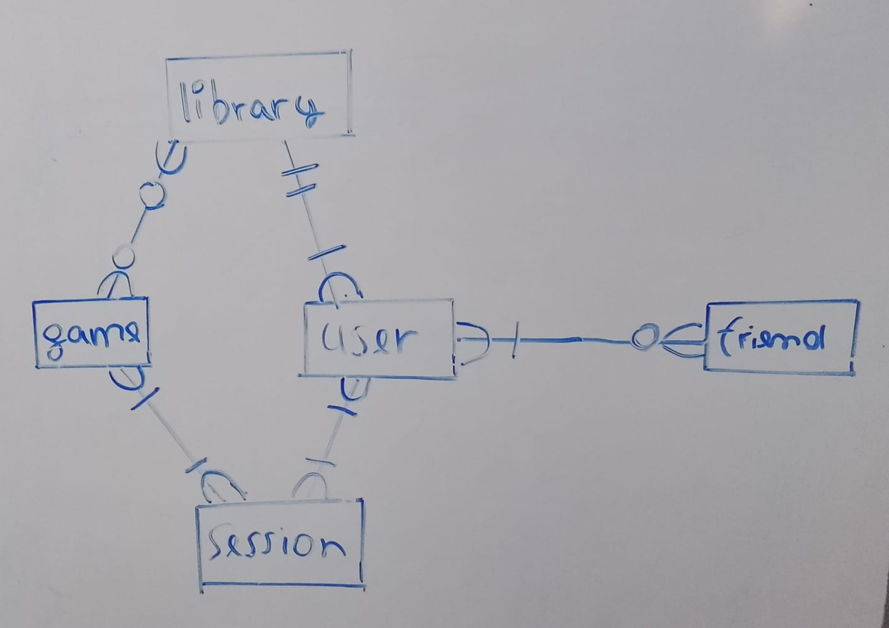

# Design Document

By José Patrick Wackerbauer Zambrano
GitHub = Patrickckckckc
Edx = jose_6941
Location = Trujillo La Libertad Peru
23/03/2026

Video overview: <https://youtu.be/kXf071zUw9k>

## Scope

* What is the purpose of your database?
The database for my final project is a simplified version of how an account on the STEAM platform would look. Its purpose is to model the essential elements of a user’s account and their interactions within the platform.

* Which people, places, things, etc. are you including in the scope of your database?
- User: Stores basic information about each user and the total number of games they own.
- Friends: Represents relationships between users.
- Games: Contains basic information about each game.
- Library: Represents the relationship between a user and the games they own.
- Session: Represents the relationship between a user and a single game.

* Which people, places, things, etc. are *outside* the scope of your database?
- The following elements are excluded from the database design:
- Reviews of games
- Detailed information about the companies that created the games
- Posts or community content related to the games
- Buying and selling options

## Functional Requirements

* What should a user be able to do with your database?
A user should be able to create an account, establish relationships with other users, view information about available games, build and manage their own library, and track gameplay information through sessions.

* What's beyond the scope of what a user should be able to do with your database?
Users will not be able to watch reviews of specific games, access community posts or additional content related to games, or perform buying and selling transactions.

## Representation
Entities are captured in SQLite tables with the following schema.

### Entities

The database includes the following entities:

#### Users

* `id`, which specifies the unique ID for the user as an `INTEGER`. This column thus has the `PRIMARY KEY` constraint applied. (Important to have uniques users)
* `username`, which specifies the user's name as `TEXT`, given `TEXT` is appropriate for name fields and a constraint of `NOT NULL` to avoid empty values.
* `total_games`, Specifies the total number of games that the user owns as `INTEGER`. `INTEGER` using the constraint
`CHECK(total_games >= 0)`to avoid negative values.

#### Friends

friends -> id, user_id, status(pending, accepted, blocked), created_at
* `id`, which specifies the unique ID for the friendship record as an `INTEGER`. This column thus has the `PRIMARY KEY` constraint applied.
* `user_id`, which specifies the ID of the user as an `INTEGER`. This column has the `NOT NULL` constraint and a `FOREIGN KEY` reference to `Users(id)`.
* `friend_id`, which specifies the ID of the other user in the friendship as an `INTEGER`. This column has the `NOT NULL` constraint and a `FOREIGN KEY` reference to `Users(id)`.
* `status`, which specifies the state of the friendship as `TEXT`. This column has the constraint `CHECK(status IN ('pending','accepted','blocked'))`.
* `created_at`, which specifies the date and time the friendship record was created as `DATETIME`. This column has the `NOT NULL` constraint applied.

#### Games

* `id`, which specifies the unique ID for the game as an `INTEGER`. This column thus has the `PRIMARY KEY` constraint applied. (Important to have unique games)
* `name`, which specifies the game's name as `TEXT`, given `TEXT` is appropriate for name fields and a constraint of `NOT NULL` to avoid empty values.
* `company`, which specifies the company's name as `TEXT`, given `TEXT` is appropriate for name fields and a constraint of `NOT NULL`.
* `type`, which specifies the type of the game `TEXT`, given `TEXT` a constraint of `NOT NULL`.

#### Library

* `user_id`, which specifies the ID of the user as an `INTEGER`. This column has the `NOT NULL` constraint and a `FOREIGN KEY` reference to `Users(id)`.
* `game_id`, which specifies the ID of the game as an `INTEGER`. This column has the `NOT NULL` constraint and a `FOREIGN KEY` reference to `Games(id)`.
* `purchase_date`, which specifies the date and time the game was purchased as `DATETIME`. This column has the `NOT NULL` constraint applied.

#### Session

* `user_id`, which specifies the ID of the user as an `INTEGER`. This column has the `NOT NULL` constraint and a `FOREIGN KEY` reference to `Users(id)`.
* `game_id`, which specifies the ID of the game as an `INTEGER`. This column has the `NOT NULL` constraint and a `FOREIGN KEY` reference to `Games(id)`.
* `last_session`, which specifies the date and time of the most recent session as `DATETIME`. This column has the `NOT NULL` constraint applied.
* `hours_played`, which specifies the total number of hours played as an `INTEGER`. This column has the constraint `CHECK(hours_played >= 0)` to avoid negative values.

### Relationships

As detailed by the diagram:

* **Users ↔ Friends**
  - One user can have zero or many friends.
  - The `Friends` table stores each connection with `user_id` and `friend_id`.

* **Users ↔ Library ↔ Games**
  - A user can own zero or many games.
  - A game can appear in zero or many libraries (if no one owns it, it’s absent).

* **Users ↔ Session ↔ Games**
  - A user can have zero or many sessions.
  - A game can appear in zero or many sessions, depending on play activity.

## Optimizations

In this section you should answer the following questions:

* Which optimizations (e.g., indexes, views) did you create? Why?
No indexes where created:
NO INDEXES ARE GOING TO BE CREATED
- Find all the games that an user has querie
  timer 0.000318 -> 0.000400

- Find the 10 most played games by time querie
 timer 0.000124 -> 0.000290
 CREATE INDEX hours_played_session ON session(hours_played);

## Optimizations

In this section you should answer the following questions:

* Which optimizations (e.g., indexes, views) did you create? Why?

No indexes were created:
**NO INDEXES ARE GOING TO BE CREATED**

- **Find all the games that a user has**
  Timer: 0.000318 → 0.000400

- **Find the 10 most played games by time**
  Timer: 0.000124 → 0.000290
  CREATE INDEX hours_played_session ON session(hours_played);

I created a view that shows all the games owned by a specific user. This view allows us to easily query the library of a particular person. Additionally, I can create similar views for other users if needed. (VIEW games_on_library_patrick)

## Limitations

In this section you should answer the following questions:

* What are the limitations of your design?
One limitation of my design was that the library did not correctly display all the games owned by a user. This issue was resolved by creating a VIEW to simplify and centralize the query.
Another limitation is that the indexes I implemented did not significantly improve the performance of the program. This may be due to the small size of the dataset or inefficient query design.

* What might your database not be able to represent very well?
The current database does not support more advanced or dynamic features, such as user-created or editable tables similar to those in platforms like Steam.
Additionally, the classification of game types could be improved. Currently, the "type" field is stored as TEXT, which is not ideal. A better approach might be to restrict values using a CHECK constraint or a separate table. However, this is challenging because there are more than 30 video game genres, and many games belong to multiple genres, making simple classification difficult.
